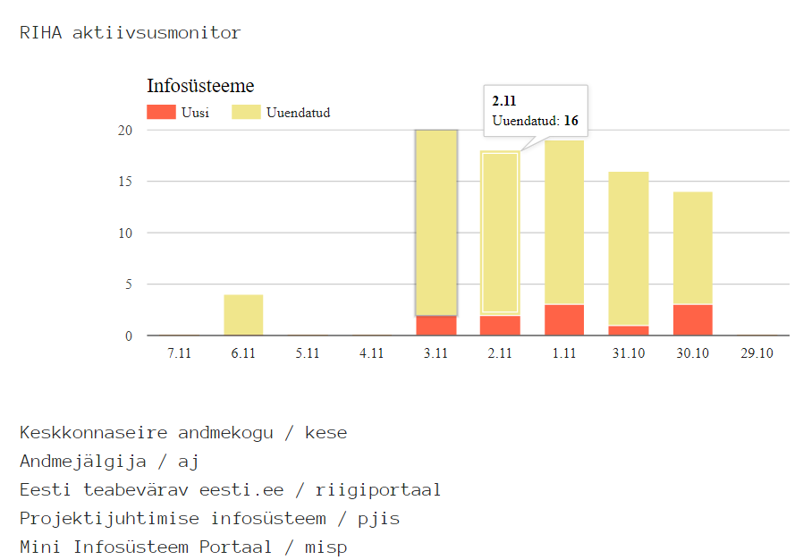

## RIHA API demo

Rakenduse avalehel [https://apidemojatest.herokuapp.com](https://apidemojatest.herokuapp.com) tehakse paar lihtsat päringut RIHA ja riigiteenused.ee API-desse.

[https://apidemojatest.herokuapp.com/watch](https://apidemojatest.herokuapp.com/watch) on RIHA "aktiivsusmonitor" - kuvab viimase 10 päeva jooksul lisatud ja uuendatud infosüsteemid.

Rakenduse serveriosa on tehtud NodeJS-s ja majutatud Herokus. Sirvijaosas on kasutatud Google Chart-i ja Bootstrap 4.

